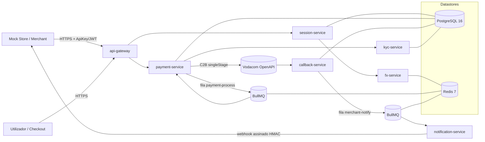

# Arquitectura — CoffePay

CoffePay é um gateway de interoperabilidade que liga carteiras móveis moçambicanas
(M-Pesa como caso de estudo, via **Vodacom Moçambique OpenAPI**) a plataformas de
checkout internacionais, dispensando cartão bancário. Este documento descreve a
arquitectura do protótipo: serviços, datastores, filas e o fluxo de pagamento.

> Fonte de requisitos e diagramas: tese (Cap. V). Modelo de dados em
> [`classDiagram.mermaid`](classDiagram.mermaid) + [`classDiagramExplanation.md`](classDiagramExplanation.md).

## 1. Visão geral

Monorepo (npm workspaces) com 7 microserviços + uma loja simulada (`mockstore`) e
uma biblioteca partilhada (`packages/shared`). Comunicação HTTP entre o exterior e o
`api-gateway`; orquestração assíncrona interna via filas BullMQ sobre Redis.

## 2. Serviços

| Serviço                | Responsabilidade                                                               | Datastores        |
| ---------------------- | ------------------------------------------------------------------------------ | ----------------- |
| `api-gateway`          | Entrada única: TLS termination, helmet, auth (ApiKey→JWT), rate-limit, routing | —                 |
| `session-service`      | Cria/gere `Session`; pede FX; devolve `checkout_url`; expiração de sessões     | PostgreSQL        |
| `payment-service`      | Checkout, validação nº, idempotência, inicia pagamento (fila → M-Pesa)         | PostgreSQL, Redis |
| `callback-service`     | Recebe/valida resultado C2B, persiste `Transaction`/`LedgerEntry`/`AuditLog`   | PostgreSQL        |
| `kyc-service`          | KYC/AML activo (regras) e passivo (risco por histórico)                        | PostgreSQL        |
| `fx-service`           | Conversão MZN↔USD com spread; cache de taxas                                   | Redis             |
| `notification-service` | Webhook assinado (HMAC) ao merchant; retry + DLQ                               | Redis             |

`packages/shared`: Prisma Client (singleton), logger (pino), erros (`AppError`),
config (zod), e — nas fases seguintes — cliente M-Pesa e crypto/HMAC.

## 3. Datastores e filas

- **PostgreSQL 16** — persistência ACID: sessões, pagamentos, transacções, ledger,
  auditoria, perfis KYC. Schema único partilhado (`packages/shared/prisma`).
- **Redis 7** — (a) cache de taxas FX com TTL; (b) backend das filas BullMQ.
- **Filas BullMQ**
  - `payment-process` — processa o pagamento de forma assíncrona (chamada C2B).
  - `merchant-notify` — entrega de webhooks ao merchant, com retry exponencial e
    **DLQ** para falhas persistentes.

## 4. Fluxo de pagamento (resumo)

1. Utilizador clica "Pagar com CoffePay" na loja → merchant chama
   `POST /api/v1/sessions/create` (ApiKey). O `session-service` fixa a taxa FX,
   calcula `amountMZN` e devolve `checkout_url`.
2. Utilizador abre o checkout, insere o nº de telemóvel e confirma →
   `POST /api/v1/sessions/:id/pay`. O `payment-service` valida (nº, KYC,
   idempotência) e **enfileira** o pagamento.
3. O worker consome a fila e executa o **C2B singleStage** na Vodacom OpenAPI
   (PIN no dispositivo do utilizador). Ver [ADR-001](adr/ADR-001-vodacom-openapi-sync-async.md).
4. O resultado é processado pelo `callback-service`: persiste `Transaction`,
   `LedgerEntry` e `AuditLog`, e enfileira a notificação.
5. O `notification-service` envia um **webhook assinado (HMAC)** ao merchant e o
   utilizador é redireccionado de volta à loja com a confirmação.

Detalhe na fig. 25 (diagrama de sequência) da tese.

## 5. Segurança (resumo)

- Merchant: ApiKey (hash bcrypt) → JWT de curta duração; rate-limit por merchant/IP.
- Webhooks: assinatura **HMAC** verificável pelo merchant.
- M-Pesa: sessão Bearer via encriptação RSA da API Key com a chave pública (≈1h).
- Privacidade: `phoneHash` (nunca o nº em claro); `keyHash` (nunca a chave em claro).
- Auditoria: `AuditLog` cobre todo o fluxo (RNF07).

## 6. Princípios

- **Idempotência** end-to-end para evitar débito duplo em retentativas (RNF05).
- **Resiliência**: filas + retry + DLQ + circuit breaker no cliente M-Pesa (RNF04).
- **Modularidade**: cada serviço isolado, `@coffepay/shared` para código comum (RNF09).
